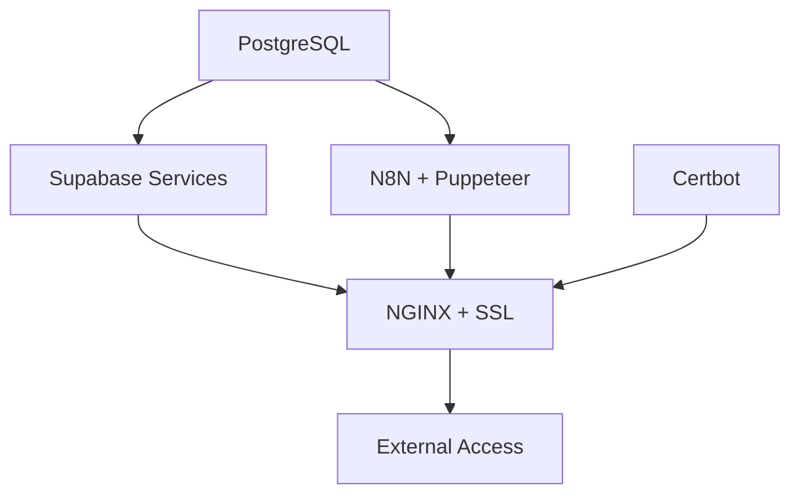

# JarvisJR Stack - Modular N8N + Puppeteer Architecture Specification

## 🎯 Project Overview

Enhance the existing JarvisJR Stack (`jj_production_stack.sh`) to support modular installation of containerized services with N8N + Puppeteer integration. Each service should be installable independently while maintaining the existing single-script architecture that the AI Productivity Hub community relies on.

## 📋 Current Project Context

- **Repository**: https://github.com/odysseyalive/JarvisJR_Stack
- **Single Script**: `jstack.sh` (downloaded as `jj_production_stack.sh`)
- **Architecture**: Single monolithic script - all functionality in one file
- **Current Services**: N8N, Supabase, NGINX with SSL, PostgreSQL
- **Network**: Docker network `jarvis_network` with security isolation
- **User Management**: Service user `jarvis` with Docker rootless setup
- **Existing Features**: Site management, backup/restore, security hardening

**CRITICAL**: All enhancements must be integrated into the single `jstack.sh` script.

## 🐳 Required Docker Images & Services

### 1. **N8N + Puppeteer Service**
```yaml
Primary Image: n8nio/n8n:latest
Enhanced with:
  - google-chrome-stable (latest stable from Google Chrome repository)
  - puppeteer@latest, puppeteer-extra@latest, puppeteer-extra-plugin-stealth@latest
  - cheerio@latest, jsdom@latest, pdf-parse@latest, xlsx@latest, csv-parser@latest
  - playwright@latest (alternative browser automation)
  
Container Name: n8n-jarvis
Ports: 5678:5678
Networks: jarvis_network
Memory: 3g (increased for Chrome)
Security: --cap-add SYS_ADMIN, --security-opt seccomp:unconfined
Volumes: 
  - n8n_data:/home/node/.n8n
  - /dev/shm:/dev/shm (required for Chrome)
Environment:
  - PUPPETEER_EXECUTABLE_PATH=/usr/bin/google-chrome-stable
  - CHROME_ARGS=--no-sandbox --disable-setuid-sandbox --disable-dev-shm-usage
  - N8N_EXECUTION_TIMEOUT=900 (15 minutes for complex operations)

Version Strategy: Use latest tags with dynamic version checking
```

### 2. **NGINX + Certbot Service**
```yaml
NGINX Image: nginx:stable-alpine (always use stable tag)
Certbot Image: certbot/certbot:latest

NGINX Container: nginx-jarvis
Ports: 80:80, 443:443
Networks: jarvis_network
Volumes:
  - nginx_conf:/etc/nginx/conf.d
  - certbot_conf:/etc/letsencrypt
  - certbot_www:/var/www/certbot

Certbot Container: certbot-jarvis
Volumes:
  - certbot_conf:/etc/letsencrypt
  - certbot_www:/var/www/certbot
Auto-renewal: systemd timer or cron job

Version Strategy: nginx:stable-alpine for production stability
```

### 3. **Supabase Service Stack**
```yaml
PostgreSQL: postgres:alpine (latest PostgreSQL with Alpine)
Kong Gateway: kong:latest
Supabase Services: Use latest tags with fallback detection
  - supabase/gotrue:latest
  - postgrest/postgrest:latest  
  - supabase/realtime:latest
  - supabase/storage-api:latest
  - supabase/studio:latest
  - supabase/postgres-meta:latest

Network: jarvis_network (private tier)
Database: Primary PostgreSQL shared with N8N

Version Strategy: Use latest tags with compatibility verification
```

## 🔧 Modular Installation Architecture

### Command Structure Enhancement
```bash
# Current (maintain compatibility) - all in single jstack.sh
./jstack.sh --install           # Full stack (default)

# New modular options (same single script)
./jstack.sh --install n8n       # N8N + Puppeteer only
./jstack.sh --install nginx     # NGINX + Certbot only  
./jstack.sh --install supabase  # Supabase stack only
./jstack.sh --install database  # PostgreSQL only

# Combined installations (same single script)
./jstack.sh --install n8n,nginx,supabase  # Custom combination
./jstack.sh --install all       # Full stack (same as default)

# Service management (same single script)
./jstack.sh --start n8n         # Start specific service
./jstack.sh --stop nginx        # Stop specific service
./jstack.sh --restart supabase  # Restart service stack
./jstack.sh --status            # Show all service status
```

## 📁 Single Script Architecture - Integration Points

### Core Implementation Strategy
**All functionality must be added to the existing `jstack.sh` script. No additional files.**

### Integration Locations within `jstack.sh`

#### 1. **Configuration Section** (Top of script, ~lines 50-150)
```bash
# Add modular service configuration to existing variables section
N8N_ENABLED="${N8N_ENABLED:-true}"
NGINX_ENABLED="${NGINX_ENABLED:-true}"
SUPABASE_ENABLED="${SUPABASE_ENABLED:-true}"
PUPPETEER_ENABLED="${PUPPETEER_ENABLED:-true}"

# Enhanced N8N + Puppeteer settings
N8N_MEMORY_LIMIT="${N8N_MEMORY_LIMIT:-3g}"
N8N_EXECUTION_TIMEOUT="${N8N_EXECUTION_TIMEOUT:-900}"
CHROME_ARGS="${CHROME_ARGS:---no-sandbox --disable-setuid-sandbox --disable-dev-shm-usage}"
```

#### 2. **Function Definitions** (Middle of script, ~lines 200-800)
```bash
# Replace existing create_n8n_container() function
create_n8n_container() {
    # Enhanced N8N with Puppeteer support
}

# Add new functions after existing ones
install_puppeteer_support() {
    # Chrome and Puppeteer installation
}

install_service_modular() {
    # Modular installation logic
}

get_latest_stable_version() {
    # Dynamic version detection
}
```

#### 3. **Command Line Parsing** (Existing argument handling section)
```bash
# Enhance existing case statement for new options
case $1 in
    --install)
        # Add support for: --install n8n, --install nginx, etc.
        ;;
    --start|--stop|--restart)
        # Add service management commands
        ;;
esac
```

#### 4. **Main Installation Logic** (Existing main() or install function)
```bash
# Modify existing installation workflow to support:
if [[ "$INSTALL_SERVICE" == "all" ]] || [[ "$INSTALL_SERVICE" == "n8n" ]]; then
    create_n8n_container
fi

if [[ "$INSTALL_SERVICE" == "all" ]] || [[ "$INSTALL_SERVICE" == "nginx" ]]; then
    create_nginx_container
fi
```

## 🌐 Network & Dependencies Architecture

### Network Topology
```yaml
jarvis_network: 172.20.0.0/16
  - Gateway: 172.20.0.1
  - DNS: Internal Docker DNS
  - Isolation: Internal service communication
  - External: Only NGINX exposed (80/443)
```

### Service Dependencies


### Dependency Installation Order
1. **Docker Network** (jarvis_network)
2. **PostgreSQL Database** (foundation)
3. **Selected Services** (parallel where possible)
4. **NGINX + SSL** (last, requires service discovery)

## 🔐 Security & Configuration Requirements

### Enhanced Security for Puppeteer
```bash
# Container security options
--cap-add SYS_ADMIN              # Required for Chrome sandbox
--security-opt seccomp:unconfined # Chrome compatibility
--shm-size=2g                     # Shared memory for Chrome
--memory=3g                       # Increased memory allocation

# Chrome security arguments
CHROME_ARGS="--no-sandbox --disable-setuid-sandbox --disable-dev-shm-usage --disable-accelerated-2d-canvas --no-first-run --no-zygote --disable-gpu --headless"
```

### Configuration Validation
```bash
validate_puppeteer_config() {
    # Memory requirements check
    # Chrome installation verification
    # Puppeteer package availability
    # Browser launch test
}

validate_service_dependencies() {
    # Network connectivity
    # Database accessibility
    # SSL certificate validity
    # Service health endpoints
}
```

## 🔍 Dynamic Version Management Strategy

### Automated Version Detection
```bash
# Dynamic version checking functions to implement
get_latest_stable_version() {
    local service="$1"
    case "$service" in
        n8n)
            # Use GitHub API to get latest release
            curl -s "https://api.github.com/repos/n8n-io/n8n/releases/latest" | grep '"tag_name":' | cut -d'"' -f4
            ;;
        nginx)
            # Use stable tag (recommended for production)
            echo "stable-alpine"
            ;;
        postgres)
            # Use major version with alpine
            echo "alpine"  # Always latest PostgreSQL
            ;;
        supabase-*)
            # Check Docker Hub API for latest tag
            curl -s "https://registry.hub.docker.com/v2/repositories/supabase/${service#supabase-}/tags/?page_size=100" | \
                jq -r '.results[].name' | grep -E '^v?[0-9]+\.[0-9]+\.[0-9]+

### System Dependencies
```bash
# Chrome dependencies (Debian/Ubuntu)
chrome_deps=(
    "wget" "gnupg" "ca-certificates" "fonts-liberation"
    "libasound2" "libatk-bridge2.0-0" "libatk1.0-0"
    "libc6" "libcairo2" "libcups2" "libdbus-1-3"
    "libexpat1" "libfontconfig1" "libgbm1" "libgcc1"
    "libglib2.0-0" "libgtk-3-0" "libnspr4" "libnss3"
    "libpango-1.0-0" "libpangocairo-1.0-0" "libstdc++6"
    "libx11-6" "libx11-xcb1" "libxcb1" "libxcomposite1"
    "libxcursor1" "libxdamage1" "libxext6" "libxfixes3"
    "libxi6" "libxrandr2" "libxrender1" "libxss1" "libxtst6"
    "lsb-release" "xdg-utils" "curl"
)
```

## 🧪 Testing & Verification Requirements

### Service Health Checks
```bash
# N8N + Puppeteer verification
test_n8n_puppeteer() {
    # N8N API endpoint test
    # Puppeteer browser launch test
    # Simple automation workflow test
    # Memory usage validation
}

# NGINX + SSL verification  
test_nginx_ssl() {
    # HTTP to HTTPS redirect
    # SSL certificate validity
    # Reverse proxy functionality
    # Rate limiting configuration
}

# Supabase stack verification
test_supabase_stack() {
    # Database connectivity
    # API endpoint responses
    # Authentication functionality
    # Studio interface accessibility
}
```

### Integration Tests
```bash
# Full stack integration test
test_full_integration() {
    # Service intercommunication
    # End-to-end workflow execution
    # Performance benchmarks
    # Security validation
}
```

## 📊 Performance & Resource Optimization

### Resource Allocation Guidelines
```yaml
Minimum System Requirements:
  RAM: 8GB (4GB + 3GB for N8N/Puppeteer + 1GB overhead)
  CPU: 4 cores (2 for N8N/Chrome, 1 for DB, 1 for web services)
  Disk: 80GB (40GB for containers, 40GB for data/logs)

Container Resource Limits:
  n8n-jarvis: 3GB RAM, 2.0 CPU
  nginx-jarvis: 512MB RAM, 0.5 CPU  
  supabase-db: 1GB RAM, 1.0 CPU
  supabase-services: 1GB RAM total, 1.0 CPU total
```

### Performance Monitoring
```bash
# Resource usage tracking
monitor_resources() {
    # Docker stats collection
    # Memory usage alerts
    # Chrome process monitoring
    # Database performance metrics
}
```

## 🔄 Backward Compatibility Requirements

### Maintain Single Script Architecture
- ✅ **Single File**: All functionality remains in `jstack.sh` - no additional scripts
- ✅ **Existing Command Compatibility**: `./jstack.sh --install` works unchanged
- ✅ **Configuration Variables**: All current variables preserved in same script
- ✅ **Site Management**: `--add-site`, `--remove-site` functionality intact within same script
- ✅ **Backup/Restore**: Existing backup system extended within same script
- ✅ **User Experience**: Same single-script installation process for end users
- ✅ **Download Method**: Same `curl` download of single `jstack.sh` file

### Single Script Integration Strategy
```bash
# All enhancements added to existing jstack.sh structure:

# 1. Variables section (top) - add new configuration variables
# 2. Functions section (middle) - enhance existing functions, add new ones  
# 3. Argument parsing (existing) - extend case statements
# 4. Main logic (existing) - add modular installation flows
# 5. Help/usage (existing) - update with new options

# NO separate files, NO separate scripts, NO complex directory structure
```

### Migration Strategy for Single Script
```bash
# Detection within single script
detect_existing_services() {
    # Check for running containers
    # Validate current configuration  
    # Determine upgrade vs fresh install
    # All logic within jstack.sh
}

# Upgrade within single script
upgrade_existing_installation() {
    # Stop services gracefully
    # Backup current state
    # Apply enhancements
    # Restore service state
    # All logic within jstack.sh
}
```

## 🎯 Implementation Success Criteria

1. **✅ Modular Installation**: Each service can be installed independently
2. **✅ Full Compatibility**: Existing installations continue to work without changes
3. **✅ N8N + Puppeteer**: Web automation capabilities fully functional
4. **✅ Resource Optimization**: Efficient memory and CPU usage
5. **✅ Security Hardening**: Maintain security standards with new services
6. **✅ Easy Maintenance**: Simple service management commands
7. **✅ Comprehensive Testing**: All services verified and health-checked
8. **✅ Documentation**: Clear usage instructions for all new features

## 🚀 Expected Outcomes

After implementation, users will be able to:
- **Install specific services**: `./jj_production_stack.sh --install n8n` for N8N + Puppeteer only
- **Web automation workflows**: Create sophisticated scraping and automation in N8N
- **Flexible deployment**: Choose which components to install based on needs
- **Resource efficiency**: Only run services they actually use
- **Easy maintenance**: Start/stop/restart individual services
- **Seamless upgrades**: Add new services to existing installations

This modular architecture preserves the simplicity that makes JarvisJR Stack successful while adding powerful new capabilities and deployment flexibility. | head -1
            ;;
        kong)
            # Use latest stable
            echo "latest"
            ;;
    esac
}

# Version compatibility verification
verify_service_compatibility() {
    local service="$1"
    local version="$2"
    
    # Test container start and basic health check
    if docker run --rm --name "test-${service}" "${service}:${version}" --version >/dev/null 2>&1; then
        return 0
    else
        log_warning "Version $version for $service failed compatibility test"
        return 1
    fi
}

# Fallback version strategy
get_fallback_version() {
    local service="$1"
    case "$service" in
        n8n) echo "latest" ;;
        nginx) echo "stable-alpine" ;;
        postgres) echo "alpine" ;;
        *) echo "latest" ;;
    esac
}

# Smart version selection with web lookup
select_optimal_version() {
    local service="$1"
    
    # Try to get latest stable version
    local latest_version=$(get_latest_stable_version "$service")
    
    if [[ -n "$latest_version" ]] && verify_service_compatibility "$service" "$latest_version"; then
        echo "$latest_version"
    else
        # Fall back to known stable version
        local fallback=$(get_fallback_version "$service")
        log_info "Using fallback version for $service: $fallback"
        echo "$fallback"
    fi
}
```

### Image Tag Strategy by Service Type
```yaml
Production-Ready Strategy:
  N8N: "latest" (N8N team maintains good backward compatibility)
  NGINX: "stable-alpine" (use stable tag for production)  
  PostgreSQL: "alpine" (always latest PostgreSQL with Alpine)
  Kong: "latest" (regularly updated, stable API)
  Certbot: "latest" (security updates important)
  
Supabase Services: "latest" with fallback verification
  - These services are designed to work together
  - Use latest tags but verify compatibility
  - Implement fallback to last-known-good versions
  
Node.js Packages: "@latest" (npm/yarn latest)
  - puppeteer@latest
  - All automation packages with @latest
  - Automatic updates via package managers
```

### Implementation Example
```bash
# In your script, replace hardcoded versions with:
NGINX_VERSION=$(select_optimal_version "nginx")
N8N_VERSION=$(select_optimal_version "n8n") 
POSTGRES_VERSION=$(select_optimal_version "postgres")

# Use in Docker commands:
docker run -d --name nginx-jarvis nginx:${NGINX_VERSION}
docker run -d --name n8n-jarvis n8nio/n8n:${N8N_VERSION}
```

### System Dependencies
```bash
# Chrome dependencies (Debian/Ubuntu)
chrome_deps=(
    "wget" "gnupg" "ca-certificates" "fonts-liberation"
    "libasound2" "libatk-bridge2.0-0" "libatk1.0-0"
    "libc6" "libcairo2" "libcups2" "libdbus-1-3"
    "libexpat1" "libfontconfig1" "libgbm1" "libgcc1"
    "libglib2.0-0" "libgtk-3-0" "libnspr4" "libnss3"
    "libpango-1.0-0" "libpangocairo-1.0-0" "libstdc++6"
    "libx11-6" "libx11-xcb1" "libxcb1" "libxcomposite1"
    "libxcursor1" "libxdamage1" "libxext6" "libxfixes3"
    "libxi6" "libxrandr2" "libxrender1" "libxss1" "libxtst6"
    "lsb-release" "xdg-utils" "curl"
)
```

## 🧪 Testing & Verification Requirements

### Service Health Checks
```bash
# N8N + Puppeteer verification
test_n8n_puppeteer() {
    # N8N API endpoint test
    # Puppeteer browser launch test
    # Simple automation workflow test
    # Memory usage validation
}

# NGINX + SSL verification  
test_nginx_ssl() {
    # HTTP to HTTPS redirect
    # SSL certificate validity
    # Reverse proxy functionality
    # Rate limiting configuration
}

# Supabase stack verification
test_supabase_stack() {
    # Database connectivity
    # API endpoint responses
    # Authentication functionality
    # Studio interface accessibility
}
```

### Integration Tests
```bash
# Full stack integration test
test_full_integration() {
    # Service intercommunication
    # End-to-end workflow execution
    # Performance benchmarks
    # Security validation
}
```

## 📊 Performance & Resource Optimization

### Resource Allocation Guidelines
```yaml
Minimum System Requirements:
  RAM: 8GB (4GB + 3GB for N8N/Puppeteer + 1GB overhead)
  CPU: 4 cores (2 for N8N/Chrome, 1 for DB, 1 for web services)
  Disk: 80GB (40GB for containers, 40GB for data/logs)

Container Resource Limits:
  n8n-jarvis: 3GB RAM, 2.0 CPU
  nginx-jarvis: 512MB RAM, 0.5 CPU  
  supabase-db: 1GB RAM, 1.0 CPU
  supabase-services: 1GB RAM total, 1.0 CPU total
```

### Performance Monitoring
```bash
# Resource usage tracking
monitor_resources() {
    # Docker stats collection
    # Memory usage alerts
    # Chrome process monitoring
    # Database performance metrics
}
```

## 🔄 Backward Compatibility Requirements

### Maintain Existing Functionality
- ✅ **Existing command compatibility**: `./jj_production_stack.sh --install` works unchanged
- ✅ **Configuration variables**: All current variables preserved
- ✅ **Site management**: `--add-site`, `--remove-site` functionality intact
- ✅ **Backup/restore**: Existing backup system extended to cover new services
- ✅ **User experience**: Same installation process for end users

### Migration Strategy
```bash
# Detect existing installations
detect_existing_services() {
    # Check for running containers
    # Validate current configuration
    # Determine upgrade vs fresh install
    # Preserve user data
}

# Graceful service upgrades
upgrade_existing_installation() {
    # Stop services gracefully
    # Backup current state
    # Apply enhancements
    # Restore service state
    # Verify functionality
}
```

## 🎯 Implementation Success Criteria

1. **✅ Modular Installation**: Each service can be installed independently
2. **✅ Full Compatibility**: Existing installations continue to work without changes
3. **✅ N8N + Puppeteer**: Web automation capabilities fully functional
4. **✅ Resource Optimization**: Efficient memory and CPU usage
5. **✅ Security Hardening**: Maintain security standards with new services
6. **✅ Easy Maintenance**: Simple service management commands
7. **✅ Comprehensive Testing**: All services verified and health-checked
8. **✅ Documentation**: Clear usage instructions for all new features

## 🚀 Expected Outcomes

After implementation, users will be able to:
- **Install specific services**: `./jj_production_stack.sh --install n8n` for N8N + Puppeteer only
- **Web automation workflows**: Create sophisticated scraping and automation in N8N
- **Flexible deployment**: Choose which components to install based on needs
- **Resource efficiency**: Only run services they actually use
- **Easy maintenance**: Start/stop/restart individual services
- **Seamless upgrades**: Add new services to existing installations

This modular architecture preserves the simplicity that makes JarvisJR Stack successful while adding powerful new capabilities and deployment flexibility.