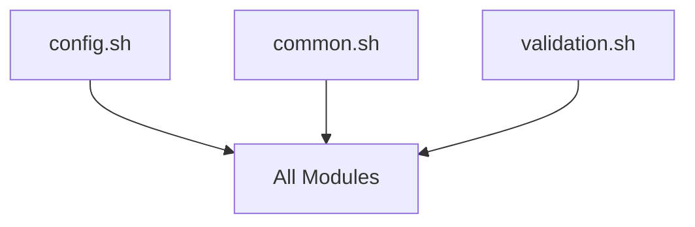

# JarvisJR Stack - Inter-Module Dependencies & Communication Patterns

## Overview
This document provides a comprehensive analysis of how modules communicate, share data, and depend on each other in the JarvisJR Stack system. Understanding these patterns is crucial for safe modifications and debugging.

## Module Dependency Hierarchy

### Level 1: Foundation Layer
**Scripts**: `config.sh`, `common.sh`, `validation.sh`
**Dependencies**: None (foundational)
**Role**: Provides core utilities and configuration to all other modules



### Level 2: Orchestration Layer  
**Scripts**: `jstack.sh`
**Dependencies**: Level 1 modules
**Role**: Command routing and high-level workflow orchestration

### Level 3: Implementation Layer
**Scripts**: `setup.sh`, `containers.sh`, SSL/backup modules (planned)
**Dependencies**: Level 1 & 2 modules
**Role**: Actual system implementation and container management

## Critical Variable Lifecycles

### 1. Configuration Variables
**Birth**: `jstack.config.default` + `jstack.config`
**Validation**: `validate_required_config()` in config.sh
**Transformation**: Variable override and export in `export_config()`
**Death**: Process termination (environment variables cleared)

**Key Variables**:
- `DOMAIN` - Propagates to all SSL and container configs
- `EMAIL` - Used for SSL certificate generation
- `SERVICE_USER` - Critical for file ownership and Docker operations
- `BASE_DIR` - Foundation for all file operations

**Communication Pattern**:
```bash
config.sh:load_config() → export_config() → $ENV_VARS → all_modules
```

### 2. Container Secrets
**Birth**: `generate_password()` and `generate_secret()` in containers.sh
**Transformation**: Written to .env files with specific formatting
**Security**: `safe_mv()`, `chmod 600`, ownership to `$SERVICE_USER`
**Death**: Container shutdown (memory cleared), files preserved for restart

**Critical Flow**:
```bash
containers.sh:generate_password() → /tmp/service.env → safe_mv() → $BASE_DIR/services/.env → docker-compose
```

### 3. Logging Context Variables
**Birth**: `setup_logging()` in common.sh
**Evolution**: `SETUP_LOG_FILE`, `PROGRESS_PID`, timing variables
**Propagation**: All functions use shared logging context
**Death**: Process completion, files preserved

## Inter-Module Communication Patterns

### 1. Source Chain Pattern
Every module follows this dependency chain:
```bash
#!/bin/bash
set -e
SCRIPT_DIR="$(cd "$(dirname "${BASH_SOURCE[0]}")" && pwd)"
PROJECT_ROOT="$(dirname "$(dirname "${SCRIPT_DIR}")"))"
source "${PROJECT_ROOT}/scripts/lib/common.sh"
source "${PROJECT_ROOT}/scripts/settings/config.sh"
load_config
export_config
```

**Critical Dependencies**:
- `common.sh` MUST be sourced before any logging
- `config.sh` MUST be loaded before accessing variables
- `export_config()` MUST be called before module operations

### 2. Function Call Delegation Pattern
Main orchestration uses bash subprocess calls:
```bash
# jstack.sh calls modules
bash "${PROJECT_ROOT}/scripts/core/setup.sh" run
bash "${PROJECT_ROOT}/scripts/core/containers.sh" deploy
```

**Why This Pattern**:
- Maintains clean separation of concerns
- Allows independent testing of modules
- Works regardless of executable permissions
- Enables dry-run mode propagation

### 3. Error Propagation Pattern
Errors flow upward through the call stack:
```bash
Module Function → log_error() → trap handler → main() → user feedback
```

**Critical Error Variables**:
- `$?` - Exit codes propagated through call chain
- `$LINENO` - Line number where error occurred
- `SETUP_LOG_FILE` - Shared error logging destination

## Data Flow Architecture

### 1. Configuration Data Flow
```
jstack.config.default (defaults)
         ↓
jstack.config (user overrides)
         ↓
validate_required_config() (validation)
         ↓
export_config() (environment export)
         ↓
ALL_MODULES (access via $VARIABLE)
```

### 2. Container Secret Flow
```
generate_password() (birth)
         ↓
/tmp/service.env (temporary storage)
         ↓
safe_mv() + chmod 600 (security transform)
         ↓
$BASE_DIR/services/.env (secure storage)
         ↓
docker-compose --env-file (consumption)
         ↓
Container environment variables (runtime)
```

### 3. Logging & Progress Flow
```
setup_logging() (initialize)
         ↓
log_*() functions (message creation)
         ↓
tee -a $SETUP_LOG_FILE (dual output)
         ↓
Console + Log File (persistence)
```

## Critical Dependencies & Risk Points

### 1. Service User Dependency
**Critical Variable**: `$SERVICE_USER`
**Risk**: ALL file operations depend on this user existing
**Mitigation**: `setup.sh` validates and creates user before other operations

**Affected Operations**:
- File ownership (`chown $SERVICE_USER:$SERVICE_GROUP`)
- Docker commands (`sudo -u $SERVICE_USER docker...`)
- Directory creation (`sudo -u $SERVICE_USER mkdir -p`)

### 2. Base Directory Dependency
**Critical Variable**: `$BASE_DIR`
**Risk**: ALL file operations use this path
**Mitigation**: Early validation in `validate_environment()`

**Affected Flows**:
- Container configurations → `$BASE_DIR/services/`
- Logging → `$BASE_DIR/logs/`
- Backups → `$BASE_DIR/backups/`
- SSL certificates → `$BASE_DIR/ssl/`

### 3. Network Dependencies
Container networking depends on Docker networks existing:
```bash
# Created in setup.sh
docker network create $JARVIS_NETWORK
docker network create $PUBLIC_TIER  
docker network create $PRIVATE_TIER
```

**Risk**: Container startup fails if networks don't exist
**Mitigation**: Networks created before containers

### 4. Configuration File Dependencies
**Critical Files**:
- `jstack.config.default` (MUST exist, version controlled)
- `jstack.config` (MUST exist, user created)

**Risk Pattern**:
```bash
if [[ ! -f "${PROJECT_ROOT}/jstack.config" ]]; then
    echo "ERROR: Configuration file not found"
    exit 1
fi
```

## Variable Mutation Boundaries

### High-Risk Mutation Points

#### 1. Configuration Override
```bash
# DANGEROUS: Variables change between these calls
source "${PROJECT_ROOT}/jstack.config.default"  # DOMAIN="example.com"
source "${PROJECT_ROOT}/jstack.config"          # DOMAIN="mydomain.com"
```
**Risk**: Assumptions about variable values become invalid
**Mitigation**: Validation after all config loading

#### 2. Environment Export
```bash
# BEFORE: Variables only in shell
export_config()
# AFTER: Variables available to subprocesses
```
**Risk**: Subprocess behavior changes based on exported state
**Mitigation**: Always call `export_config()` before subprocess calls

#### 3. Container Secret Generation
```bash
# Variables created dynamically with random values
postgres_password=$(generate_password)  # Different every run
```
**Risk**: Secrets change between runs, breaking existing containers
**Mitigation**: Preserve .env files, only regenerate on fresh install

## Communication Safety Patterns

### 1. Safe Variable Access
```bash
# SAFE: Check variable exists before use
if [[ -n "$DOMAIN" ]]; then
    use_domain_variable
fi

# UNSAFE: Assume variable exists
echo "Domain is $DOMAIN"  # Fails if DOMAIN unset
```

### 2. Safe Function Calls
```bash
# SAFE: Check function return codes
if validate_environment && check_prerequisites; then
    proceed_with_setup
else
    handle_validation_failure
fi

# UNSAFE: Ignore return codes
validate_environment
check_prerequisites
proceed_with_setup  # May run with invalid environment
```

### 3. Safe File Operations
```bash
# SAFE: Use wrapper functions
safe_mv "/tmp/config" "$SECURE_LOCATION"

# UNSAFE: Direct operations
mv "/tmp/config" "$SECURE_LOCATION"  # No validation or error handling
```

## Module Integration Checklist

When adding new modules or modifying existing ones:

### ✅ Required Dependencies
- [ ] Sources `common.sh` for logging functions
- [ ] Sources `config.sh` for configuration access  
- [ ] Calls `load_config` before using variables
- [ ] Calls `export_config` before subprocess calls
- [ ] Uses `set -e` for immediate error exit

### ✅ Variable Safety
- [ ] Validates required variables before use
- [ ] Uses safe file operation functions
- [ ] Properly handles variable mutations
- [ ] Documents variable lifecycle in functions

### ✅ Error Handling  
- [ ] Uses `log_error()` for error reporting
- [ ] Propagates exit codes correctly
- [ ] Provides cleanup on failure
- [ ] Supports dry-run mode (`$DRY_RUN`)

### ✅ Integration Points
- [ ] Compatible with main orchestration calls
- [ ] Follows naming conventions
- [ ] Maintains security boundaries
- [ ] Documents dependencies clearly

## Architecture Evolution Points

### Current State
- Modular bash script architecture
- Environment variable communication
- Function delegation pattern
- Error propagation through exit codes

### Future Considerations
When the architecture evolves, maintain these communication patterns:
1. **Configuration inheritance** - New modules must access shared config
2. **Logging consistency** - All operations must use shared logging
3. **Security boundaries** - Maintain service user isolation  
4. **Error transparency** - Preserve error traceability to main script

## Summary

The JarvisJR Stack uses a well-structured dependency hierarchy where:
1. **Foundation layers** provide utilities to all modules
2. **Configuration flows** unidirectionally from files to runtime
3. **Error handling** propagates upward through the call stack
4. **Security boundaries** are maintained through service user isolation

Understanding these patterns is essential for:
- **Safe modifications** - Know what depends on what you're changing  
- **Debugging** - Understand data flow when things break
- **Testing** - Mock dependencies appropriately
- **Documentation** - Accurately describe system behavior

The architecture prioritizes safety, modularity, and transparency - key principles for production infrastructure management systems.